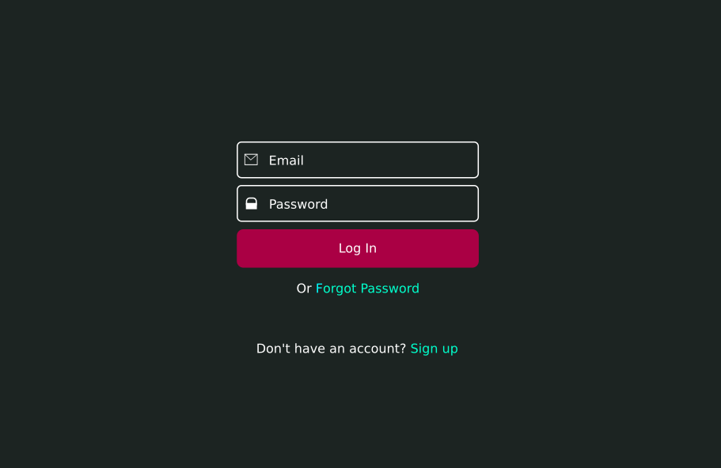

# Ready React Login

Login page built with React

## Dependencies

    react: ^16.4.2
    react-dom: ^16.4.2
    react-scripts: 1.1.5

## See this working

Get download [here](https://github.com/ready-react/ready-react-login/archive/master.zip) and extract:

Copy `/build` to your local server (as Apache or Nginx). And see in http://localhost.

or use `npm`:

    cd ready-react-login
    npm install
    npm start

Open [http://localhost:3000](http://localhost:3000) to view it in the browser.

## Usage

1 - Get download [here](https://github.com/ready-react/ready-react-login/archive/master.zip)

2 - Copy the folder `/src/ready-react-login` into your project `/src/components`.

3 - Install the [dependencies](#dependencies):

    cd ready-react-login
    npm install